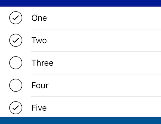
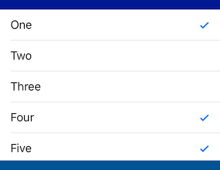

# SelectionList
Simple single-selection or multiple-selection checklist, based on UITableView.

[![Swift Version][swift-image]][swift-url]
[![Build Status][travis-image]][travis-url]
[![License][license-image]][license-url]
[](https://img.shields.io/cocoapods/v/SelectionList.svg)  
[](http://cocoapods.org/pods/SelectionList)
[](http://makeapullrequest.com)

<p align="center">
&nbsp;&nbsp;&nbsp;&nbsp;
</p>

## Usage

```swift
let selectionList = SelectionList()
selectionList.items = ["One", "Two", "Three", "Four", "Five"]
selectionList.addTarget(self, action: #selector(selectionChanged), for: .valueChanged)
selectionList.selectedIndex = 3
```

## Multiple Selection

```swift
selectionList.allowsMultipleSelection = true
selectionList.selectedIndexes = [0, 1, 4]
```

## Changing Appearance

The following properties can be changed either in Interface Builder or in code:

```swift
selectionList.selectionImage = UIImage(named: "v")
selectionList.deselectionImage = UIImage(named: "o")
selectionList.isSelectionMarkTrailing = false // to put checkmark on left side
selectionList.rowHeight = 42.0
```

You can do additional styling in code:

```swift
selectionList.setupCell =  { (cell: UITableViewCell, index: Int) in
    cell.textLabel?.textColor = .gray
}
```

## Requirements

- iOS 9.0+
- Xcode 9+

## Installation

### CocoaPods:

```ruby
pod 'SelectionList'
```

Legacy versions:

| Swift version | SelectionList version |
| :---: | :---: |
| 4.1 (Xcode 9.4) | `pod 'SelectionList', '~> 1.2.0'` |
| 4.0 | `pod 'SelectionList', '~> 1.0.2'` |

### Swift Package Manager:

```swift
dependencies: [
    .package(url: "https://github.com/yonat/SelectionList", from: "1.3.2")
]
```

## Meta

[@yonatsharon](https://twitter.com/yonatsharon)

[https://github.com/yonat/SelectionList](https://github.com/yonat/SelectionList)

[swift-image]:https://img.shields.io/badge/swift-4.2-orange.svg
[swift-url]: https://swift.org/
[license-image]: https://img.shields.io/badge/License-MIT-blue.svg
[license-url]: LICENSE.txt
[travis-image]: https://img.shields.io/travis/dbader/node-datadog-metrics/master.svg?style=flat-square
[travis-url]: https://travis-ci.org/dbader/node-datadog-metrics
[codebeat-image]: https://codebeat.co/badges/c19b47ea-2f9d-45df-8458-b2d952fe9dad
[codebeat-url]: https://codebeat.co/projects/github-com-vsouza-awesomeios-com
